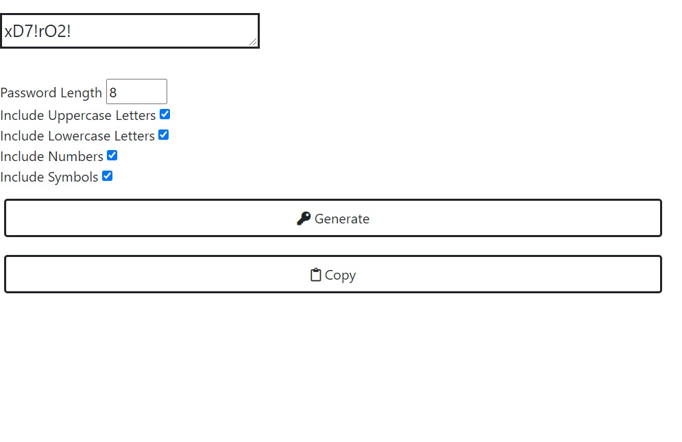

# JS-Password-Generator  :lock_with_ink_pen:



It enables you to generate your own passwords with different degrees of power and security and adjust them to the length, characters, etc. You can include it in your website very easily, where no outside libraries have been used. Only Java Script.

This writing method is not the only one and you can generate the same results in different ways in the same language.
I hope it's useful to you in your work, and I'm going to constantly improve its coordination and add new features to it.

- Explain Code  </br>
Here we use some function to generate a strings from Uppercase and lowercase letters, numbers and symbols
```java-script
function getRandomLower() {
    return String.fromCharCode(Math.floor(Math.random() * 26) + 97);
}

function getRandomUpper() {
    return String.fromCharCode(Math.floor(Math.random() * 26) + 65);
}

function getRandomNumber() {
    return String.fromCharCode(Math.floor(Math.random() * 10) + 48);
}

function getRandomSymbol() {
    const symbols = "!@#$%^&*(){}[]=/<>,."
    return symbols[Math.floor(Math.random() * symbols.length)];
}

const randomFunc = {
    lower: getRandomLower,
    upper: getRandomUpper,
    number: getRandomNumber,
    symbol: getRandomSymbol,
};
```
This is the code that executes the command when the button is pressed in order to collect and generate those values
```java-script
const generate = document.getElementById("generateBtn");
generate.addEventListener("click", () => {
    const length = document.getElementById("PasswordLength").value;
    const hasUpper = document.getElementById("uppercase").checked;
    const hasLower = document.getElementById("lowercase").checked;
    const hasNumber = document.getElementById("numbers").checked;
    const hasSymbol = document.getElementById("symbols").checked;
    const result = document.getElementById("PasswordResult");
    result.innerText = generatePassword(
        hasLower,
        hasUpper,
        hasNumber,
        hasSymbol,
        length
    );
});

function generatePassword(lower, upper, number, symbol, length){
    let generatedPassword = "";
    const typesCount = lower + upper + number + symbol;
    const typesArr = [{lower}, {upper}, {number}, {symbol}].filter(
        (item) => Object.values(item)[0]
    );
    for (let i = 0; i < length; i += typesCount){
        typesArr.forEach((type) => {
            const funcName = Object.keys(type)[0];
            generatedPassword += randomFunc[funcName]();
        });
    }
    const finalPassword = generatedPassword.slice(0, length);
    return finalPassword;
}
```
And the last ting is the code for the "copy to clipboard" button in order to copy the generated password.

```java-script
let button = document.getElementById("clipboardBtn");
button.addEventListener("click", (e) => {
    e.preventDefault();
    document.execCommand(
        "copy",
        false,
        document.getElementById("PasswordResult").select()
    );
});
```
Note: This is optional, you can not add it, it's up to how useful this code can be in your projects.

Credits
-------
- [Linkedin Account](https://www.somar-kesen.com/)  </br>
- [My website](https://www.somar-kesen.com/)
